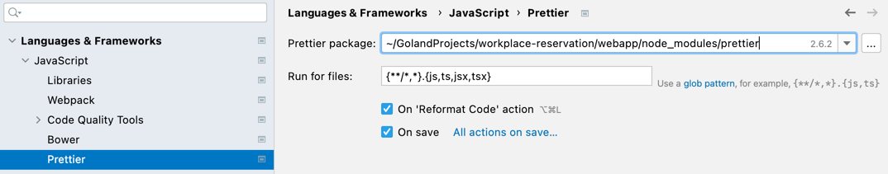
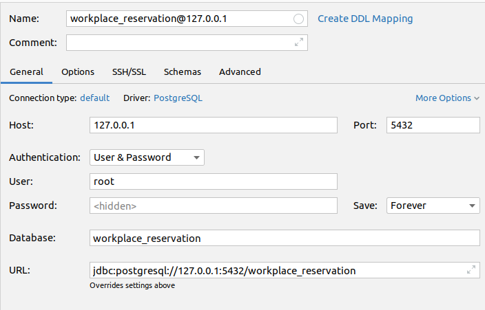

# :calendar: workplace-reservation :computer:
## Features
* Full day workplace reservations _(only 1 click needed)_
* Recurring reservations
* Admin panel for managing reservations, offices and workplaces
* Overview of office occupancy

## Demo

Test the features with the [live-demo](https://workplace-reservation.florian-glombik.de/)! 

## Motivation
When working in a start-up with a shared office, meaning there were no fixed working places, we relied on calendar entries to coordinate office utilization. However, this did not work out well due to the following reasons:
- It was not easy to see who would be in the office, which is interesting, as it ensures you meet your development team when visiting the office.
- The entries in the calendar cluttered the whole calendar, leading to the "reservations" not being updated and nobody viewing the entries anymore.

These habits led to the problem that we had days on which the office was empty and other days where more people than workplaces have been in the office. Unfortunately, it happened regularly that multiple people didn't have an actual working place, needed to work in the kitchen or did not find a suitable place to work.

**This project aims to provide a simple solution to manage the capacity of a shared office.**

## Get Started (~15 min)

1. Install Docker and docker-compose on the VM *(e.g. linux:ubuntu)*
2. Clone this Repository on your VM 
3. Fill in your custom data in `/infra/.env` *(client and server need to have different domains for the reverse proxy caddy to work)*
4. Adjust your primary server URL in the config file `webapp/.env`
5. Create the network `web`
   ```
   docker network create web
   ```
6. Execute the docker-compose file in the folder `infra` :warning:
   ```
   docker-compose up -d
   ```
7. Create the database by manually executing the following command in the `server` folder *(make sure to adjust the statement according to your environment variables and docker container names)*
   ```
   make create_db
   ```
8. install [migrate](https://github.com/golang-migrate/migrate/blob/master/cmd/migrate/README.md) for database migrations
   1. Find the [release that fits your environment]((https://github.com/golang-migrate/migrate/releases))
   2. Adjust the download command accordingly *(`$version`, `$os` and `$arch` need to be adjusted according to the fitting release from the previous step)*
      ```
      curl -L https://github.com/golang-migrate/migrate/releases/download/$version/migrate.$os-$arch.tar.gz
      ```
      *e.g. this could look like this for an amd ubuntu VM:*
      ```
      curl -L https://github.com/golang-migrate/migrate/releases/download/v4.15.2/migrate.linux-amd64.tar.gz
      ```
   3. Extract the downloaded archive
      ```
      tar xvzf migrate.$os-$arch.tar.gz
       ```
      *e.g. this could look like this for an amd ubuntu VM:*
       ```
       tar xvzf migrate.linux-amd64.tar.gz
       ```
   4. Make the command usable by moving it to the `bin` folder
      ```
      sudo mv migrate /usr/local/bin/
      ```
   5. You have installed migrate :raised_hands:
      
      *Execute the following to double-check the installation was successfull*
      ```
      migrate -version
      ```
9. Execute the database migration in the folder `server` *(make sure to adjust the migrate_up command according to your environment variables and docker container names)*
   ```
   make migrate_up
   ```
10. The service should be up and running, checkout your domain!
11. Create a user by navigating to your client URL and registering as user
12. Give your user Admin rights manually
    1. Open a shell on the `database` container, *e.g. with*
        ```
        docker exec -it database bash
        ```
    2. Start psql by executing 
        ```
        psql
        ```
    3. Connect to the database *(list databases with ``\l`)*
        ```
        \connect workplace_reservation
        ```
    4. Update the `role` of your user with SQL to `admin`
       1. List the available tables
            ```
            \dt
            ```
       2. View the entry of your user in the database
            ```
            SELECT * FROM users;
            ```
       3.  Update the role of your user
            ```
            UPDATE users SET role = 'admin' WHERE id = '<your-user-id>';
            ```
       4.  Check if the role has been updated properly
            ```
            SELECT * FROM users;
            ```
       5.  Exit the psql shell
           ```
           \q
           ```
13. Logout and Login again to make sure that the admin rights are taking effect

Your instance is running and ready to be used by your and your colleagues! :tada:

*(You might want to create the offices and workplaces in the application before you share the link with your colleagues :wink:)* 
      

## Developer Setup Guide

### Create the Database
Within this step I describe the process of creating a PostgreSQL when using docker.

Pull your favourite [PostgreSQL docker image](https://hub.docker.com/_/postgres). I decided to use the tag `14-alpine`,
resulting in the CLI-command
```
docker pull postgres:14-alpine
```

After pulling the image, the container needs to be started: <br>
_Make sure to exchange `<user-name>` and `<password>` with your custom values before executing the command._
```
docker run --name postgres14 -p 5432:5432 -e POSTGRES_USER=<user-name> -e POSTGRES_PASSWORD=<password> -d postgres:14-alpine
```

We have now set up our Postgres instance within the docker container, but still need to create the database.
To do so, navigate to the folder `server`. Within this folder execute the following commands:
<br>
_If you did not name your container `postgres14` the predefined `create_db`/`dop_db` commands will not work.
Make sure to adjust the commands in `server/Makefile` properly to match the name of your Postgres docker container._

Create the database within the container:
```
make create_db
```

Add the database schema by running a migration:
```
make migrate_up
```

### Start the Application
We are using sqlc to generate code for the SQL queries. We need to generate the code before running the application.
Execute the following command within the `server` folder:
```
make sqlc
```

### Prerequisite Installations
Make sure to install:
- [Go](https://go.dev/) _- at least version 1.18_
- [docker](https://www.docker.com/get-started/) _- keeps our PostgresSQL database_
- [npm](https://www.npmjs.com/) _- used as package manager, e.g. for importing [React](https://reactjs.org/)_
- [migrate](https://github.com/golang-migrate/migrate/blob/master/cmd/migrate/README.md) _- framework used for database migrations_
- [sqlc](https://docs.sqlc.dev/en/latest/overview/install.html) _- used for generation of Go code from SQL queries; there is currently (1.13) no support for Postgres sqlc for Windows_

### Before First Startup
You will need to download the used packages and frameworks.

For the Go Server: Make sure to sync the imports/modules

For the Client/Webapp: Make sure to execute `npm install` within the folder `workplace-reservation/webapp`


### Client
Make sure to use [prettier](https://www.jetbrains.com/help/idea/prettier.html)

<br>
The project is based on Go and React. I use [GoLand](https://www.jetbrains.com/de-de/go/) as IDE and included my project
configurations within this repository, which might save you some time getting started with the project in case you do not
prefer another IDE.

If you are using GoLand the prettier configuration will look like this: <br>
You will need to install the [prettier plugin](https://plugins.jetbrains.com/plugin/10456-prettier) and restart the GoLand before this selection appears.

### Server

#### GoLand Database Configuration example
 <br>

#### Swagger API

https://github.com/swaggo/gin-swagger

execute `swag init` in `server/src`
Once you have started the server you can find a visual representation of the [Swagger API](http://0.0.0.0:8080/swagger/index.html).
